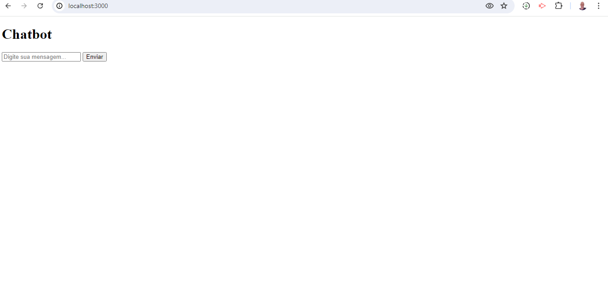
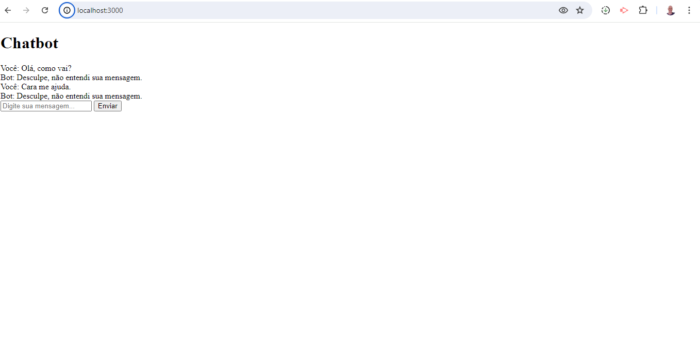

# Conversify Chatbot


## Resolvi criar esse chatbot bem simples na versão JavaScript.

## Este é um projeto de um chatbot simples desenvolvido com Node.js utilizando o framework Express e a linguagem de template EJS.

# Tecnologias Utilizadas

- **Express**: Framework web para Node.js que simplifica o desenvolvimento de aplicações web e APIs.
  - [Saiba mais sobre Express](https://expressjs.com/)

- **EJS (Embedded JavaScript)**: Linguagem de modelagem que permite gerar HTML com JavaScript de forma dinâmica.
  - [Saiba mais sobre EJS](https://ejs.co/)

- **Body-parser**: Middleware para o Express que facilita o acesso aos dados enviados pelo cliente no corpo das requisições HTTP.
  - [Saiba mais sobre Body-parser](https://www.npmjs.com/package/body-parser)

## Estrutura do Projeto

- **`views/`**: Contém os templates EJS utilizados para renderizar as páginas HTML dinâmicas.
  - Exemplos: `index.ejs`

- **`server.js`**: Arquivo principal que configura o servidor Express, define rotas e lógica de resposta.

## Como Executar

1. Clone este repositório:
   ```bash
   git clone https://github.com/seu_usuario/conversify.git
   cd conversify

2. Instale as dependências:
   npm install

3. Inicie o servidor:
   npm start

4. Abra seu navegador e acesse http://localhost:3000 para interagir com o chatbot.

## Telas

1. Tela principal assim que carrega o chatbot:
   

2. Testando o chatbot:
   

## Feedback

Sinta-se à vontade para explorar e dar feedback através de elogios, sugestões e críticas.


## Como Contribuir

Se você deseja contribuir para o desenvolvimento deste projeto, siga as etapas abaixo:

### Relatando Problemas

Se encontrar algum problema ou tiver sugestões de melhorias, por favor, abra uma "Issue". Antes de criar uma nova "Issue", verifique se o problema já não foi relatado por outra pessoa.

### Contribuindo com Código

Se você deseja contribuir com código, siga estas etapas:

1. Fork do repositório.
2. Crie uma nova branch para suas alterações: `git checkout -b nome-da-sua-branch`.
3. Faça as alterações desejadas e faça commit: `git commit -m "Descrição das alterações"`.
4. Faça push para a sua branch: `git push origin nome-da-sua-branch`.
5. Abra um Pull Request (PR) com uma descrição clara das alterações propostas.

Agradeço antecipadamente por suas contribuições e terá atualização com criação de novos componentes, recursos e funcionalidades.

## Estrelas

Peço encarecidamente, se puder, dar estrela para que o projeto fique em destaque e mostre as outras pessoas.
